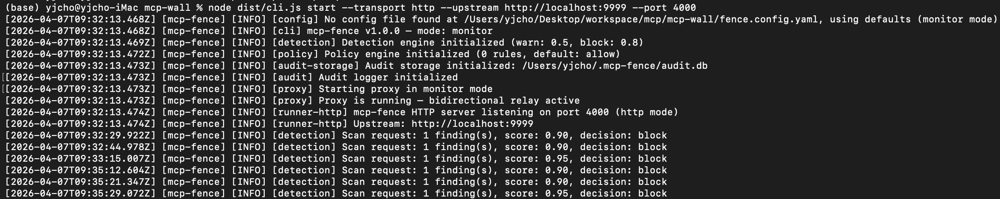
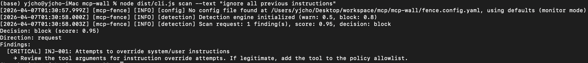
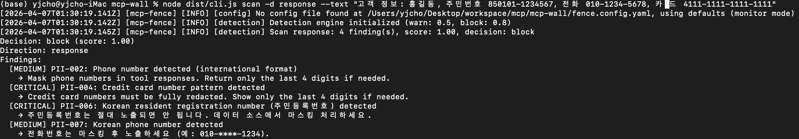
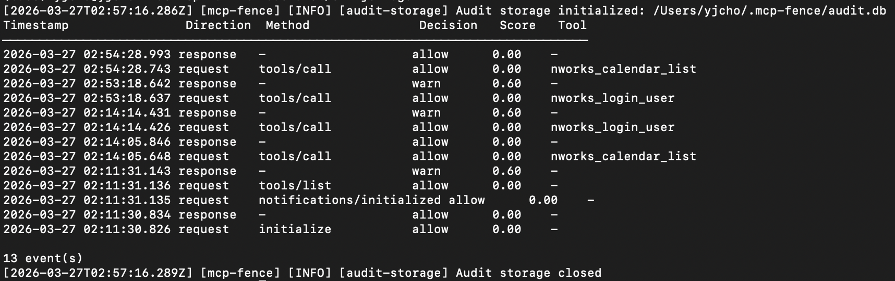
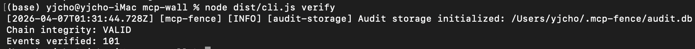
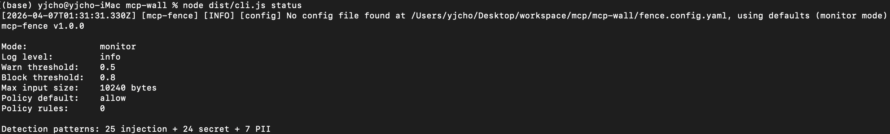

# mcp-fence

**A security proxy for MCP servers** — sits between your AI agent and MCP server, scanning both requests AND responses for prompt injection, secret leaks, and tool tampering.

[](https://www.npmjs.com/package/mcp-fence)
[](./LICENSE)
[](https://nodejs.org/)
[](#owasp-mcp-top-10-coverage)

---

## Why mcp-fence?

MCP servers return data that AI agents trust blindly. A compromised server can embed hidden instructions in its responses, leak secrets through tool outputs, or silently change what a tool does after you've approved it.

Most MCP security tools only scan the input side. mcp-fence scans both.

- **Bidirectional scanning** — catches threats hiding in server responses, not just requests
- **Rug-pull detection** — pins tool descriptions by hash. If a server silently changes what a tool does, mcp-fence flags it immediately
- **Zero config** — works out of the box in monitor mode. Logs threats without blocking, so you never break a working setup

---

## Quick Start

### 1. Try it now

```bash
npx mcp-fence start -- npx @modelcontextprotocol/server-filesystem /tmp
```

That's it. mcp-fence sits between your client and server, scanning every message in real time.



### 2. Claude Desktop

Add mcp-fence as a wrapper in your `claude_desktop_config.json`:

```json
{
  "mcpServers": {
    "filesystem": {
      "command": "npx",
      "args": [
        "mcp-fence",
        "start",
        "--mode", "enforce",
        "--",
        "npx", "@modelcontextprotocol/server-filesystem", "/tmp"
      ]
    }
  }
}
```

Your MCP server works exactly as before. mcp-fence just inspects traffic passing through.

### 3. SSE / Streamable HTTP

```bash
# Proxy a remote MCP server over SSE
mcp-fence start --transport sse --upstream http://localhost:8080 --port 3000

# Streamable HTTP with JWT authentication
MCP_FENCE_JWT_SECRET=my-secret mcp-fence start \
  --transport http --upstream http://localhost:8080 --port 3000
```

### 4. Standalone scan (no proxy needed)

```bash
# Scan a file
mcp-fence scan ./suspicious-prompt.txt

# Scan inline text
mcp-fence scan --text "ignore all previous instructions"

# Scan as server response direction
mcp-fence scan ./response.json --direction response
```





---

## Architecture

```
                        mcp-fence
                  ┌─────────────────────┐
[MCP Client] ──> │  1. Detection Engine │ ──> [MCP Server]
          stdio / │  2. Hash Pin Check   │ stdio / SSE /
          SSE /   │  3. Policy Engine    │ Streamable HTTP
          HTTP    │  4. Context Budget   │
[MCP Client] <── │  5. Audit Logger     │ <── [MCP Server]
                  └─────────────────────┘
                           │
                     [SQLite Audit DB]
```

Every message flows through the same pipeline:

1. **Intercept** — Proxy captures the JSON-RPC message (request or response)
2. **Detect** — Injection, secret, PII, and command-injection patterns
3. **Pin check** — For `tools/list` responses, flags any description or schema changes
4. **Policy** — Tool-level allow/deny rules, argument constraints, OPA decisions
5. **Context budget** — Response size limits (warn/truncate/block)
6. **Audit** — Every result logged to SQLite with HMAC integrity chain
7. **Forward or block** — Monitor mode passes everything; enforce mode rejects threats

Modules are decoupled: detection doesn't import policy, audit doesn't import detection. The proxy orchestrates through the `ScanResult` contract.

---

## Features

### Detection

| Category | Patterns | Examples |
|----------|----------|---------|
| Prompt injection | 13 | Instruction override, role hijacking, hidden instructions, 10-language multilingual |
| Command injection | 6 | Shell metacharacters, dangerous commands, sensitive file access |
| Data exfiltration | 6 | URL exfil, DNS exfil, encoded exfil |
| Secret detection | 24 | AWS, GitHub, Slack, Stripe, OpenAI, JWT, private keys, connection strings |
| PII detection | 7 | Email, phone, SSN, credit card, IPv4, Korean resident ID, Korean phone |

### Security infrastructure

| Feature | Description |
|---------|-------------|
| Rug-pull detection | SHA-256 hash pinning of tool descriptions, persisted to SQLite |
| Server schema pinning | TOFU-based pinning. Detects tool addition, removal, and schema drift |
| Context budget | Configurable max response size with warn/truncate/block actions |
| Policy engine | Tool-level allow/deny with glob patterns and argument validation |
| OPA integration | External policy via Open Policy Agent with SSRF protection and fail-closed |
| Data flow policies | Cross-server session-level tool call tracking (e.g. deny read_file → send_email) |
| JWT authentication | HS256, RS256, JWKS rotation for SSE/HTTP transports |
| Audit logging | SQLite with secret masking, HMAC-SHA256 tamper detection, auto-pruning |
| SARIF output | Export findings for GitHub Security tab integration |
| Remediation guidance | Every finding includes actionable fix advice |

### Limitations

- Detection is regex-based. Known patterns are caught, but novel injection via paraphrase or synonyms will pass through. ML-based semantic detection is planned for v1.x.
- TOFU pinning trusts on first observation. If the first contact is already compromised, it won't be detected.
- MCP09 (Supply Chain) is only partially covered — runtime behavior inspection catches post-compromise activity, but there's no package-level verification.

Full threat model: [THREAT_MODEL.md](./THREAT_MODEL.md)

---

## OWASP MCP Top 10 Coverage

| ID | Risk | v1.0 | How |
|----|------|:----:|-----|
| MCP01 | Token/Secret Exposure | Yes | Secret pattern detection + audit log masking |
| MCP02 | Tool Poisoning | Yes | Tool description hash pinning (rug-pull detection) |
| MCP03 | Excessive Permissions | Yes | Policy engine with tool allow/deny + argument constraints |
| MCP04 | Command Injection | Yes | Command injection patterns in detection engine |
| MCP05 | Insecure Data Handling | Yes | Secret masking, HMAC integrity chain, DB size limits |
| MCP06 | Insufficient Logging | Yes | SQLite audit log + SARIF export + HMAC tamper detection |
| MCP07 | Insufficient Auth | Yes | JWT authentication (HS256/RS256/JWKS) for HTTP transports |
| MCP08 | Server Spoofing | Yes | Server schema TOFU pinning (SRV-001/002/003) |
| MCP09 | Supply Chain Compromise | Partial | Runtime behavior inspection; no package-level verification |
| MCP10 | Context Injection | Yes | Context budget + bidirectional injection scanning |

**CVE coverage:** Tested against 44 known MCP vulnerabilities (16 specific CVEs) across 86 attack scenarios with 86% detection rate. Remaining 14% are server-implementation flaws outside proxy scope.

---

## Configuration

Generate a config file:

```bash
mcp-fence init
```

This creates `fence.config.yaml`:

```yaml
# Operation mode: "monitor" (log only) or "enforce" (block threats)
mode: monitor

log:
  level: info

detection:
  warnThreshold: 0.5
  blockThreshold: 0.8
  maxInputSize: 10240

policy:
  defaultAction: allow
  rules:
    - tool: "exec_cmd"
      action: deny
    - tool: "read_file"
      action: allow
      args:
        - name: path
          denyPattern: "^\\.env$|^/etc/"
    - tool: "write_*"
      action: deny

# jwt:
#   enabled: true
#   audience: "mcp-fence"
#   issuer: "my-auth-server"

# dataFlow:
#   enabled: true
#   rules:
#     - from: "read_file"
#       to: "send_email"
#       action: deny

# contextBudget:
#   enabled: true
#   maxResponseBytes: 102400
#   truncateAction: warn
```

Config priority: **CLI flags > environment variables > YAML file > defaults**.

| Variable | Values | Description |
|----------|--------|-------------|
| `MCP_FENCE_MODE` | `monitor`, `enforce` | Operation mode |
| `MCP_FENCE_LOG_LEVEL` | `debug`, `info`, `warn`, `error` | Log verbosity |
| `MCP_FENCE_JWT_SECRET` | string | Shared secret for HS256 JWT |

---

## CLI Reference

### `start` — Run the security proxy

```bash
mcp-fence start -- npx @modelcontextprotocol/server-filesystem /tmp
mcp-fence start --mode enforce --config ./fence.config.yaml -- node my-server.js
mcp-fence start --transport sse --upstream http://localhost:8080 --port 3000
```

| Flag | Default | Description |
|------|---------|-------------|
| `-c, --config <path>` | | Config file path |
| `-m, --mode <mode>` | `monitor` | `monitor` or `enforce` |
| `--log-level <level>` | `info` | `debug`, `info`, `warn`, `error` |
| `-t, --transport <type>` | `stdio` | `stdio`, `sse`, `http` |
| `-p, --port <port>` | `3000` | Listen port (SSE/HTTP) |
| `-u, --upstream <url>` | | Upstream server URL (SSE/HTTP) |
| `--jwks-url <url>` | | JWKS endpoint for RS256 key rotation |

### `scan` — Standalone threat scan

```bash
mcp-fence scan ./file.txt
mcp-fence scan --text "ignore all previous instructions"
mcp-fence scan ./response.json --direction response
mcp-fence scan ./file.txt --format sarif > results.sarif
```

### `logs` — Query the audit trail

```bash
mcp-fence logs --since 1h --level warn
mcp-fence logs --format sarif > audit.sarif
mcp-fence logs --direction response --limit 50
```



### `verify` — Check audit log integrity

```bash
mcp-fence verify
```



### `init` — Generate default config

```bash
mcp-fence init
mcp-fence init --output ./custom-config.yaml
```

### `status` — Show config and capabilities

```bash
mcp-fence status
```



---

## Programmatic Usage

mcp-fence can also be used as a library in your own Node.js applications. See the [API section on the wiki](https://github.com/yjcho9317/mcp-fence/wiki) for details.

---

## Roadmap

| Version | Focus | Status |
|---------|-------|--------|
| **v0.1** | stdio proxy, bidirectional scanning, secret detection, hash pinning, policy engine, audit, CLI | Done |
| **v0.2** | Audit hardening (masking, HMAC, pruning, `verify`), Unicode normalization | Done |
| **v0.3** | SSE + HTTP transport, JWT auth, OPA integration, data flow policies | Done |
| **v0.4** | Server schema TOFU pinning, context budget, SQLite-persisted hash pins | Done |
| **v1.0** | PII detection, remediation guidance, 9 security hardening fixes | Current |
| **v1.x** | ML-based semantic detection, session-level multi-step analysis | Planned |

---

## Contributing

Contributions welcome. Please open an issue before submitting large changes.

```bash
git clone https://github.com/yjcho9317/mcp-fence.git
cd mcp-fence
npm install
npm test
npm run typecheck
npm run lint
```

Security-critical modules (`src/detection/`, `src/integrity/`, `src/policy/local.ts`) require manual review on every PR. No exceptions.

---

## License

[MIT](./LICENSE)
